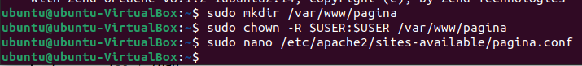

# Ejercicio 1: Instalación de Apache

## Paso 1: 
**Utilizamos el comando sudo apt install apache2** 

## Paso 2: 
**Instalamos sql y pondremos el comando sudo apt install mysql-server**

## Paso 3: 
**utilizamos el comando mysql_secure_installation y pondremos Y y confirmaremos todo**

## Paso 4: 
**Utilizamos el siguiente comando para instalar php: sudo apt install php libapache2-mod-php php-mysql**

## Paso 5: 
**Crearemos una carpaeta con el nombre de nuestro pagina, modificamos los permisos y le crearemos un .conf**

## Paso 6: 
**Editaremos el siguiente texto con los siguientes apartados:**

## Paso 7: 
**Utilizaremos el comando sudo a2ensite pagina para aplicarle una nueva configuracion**

