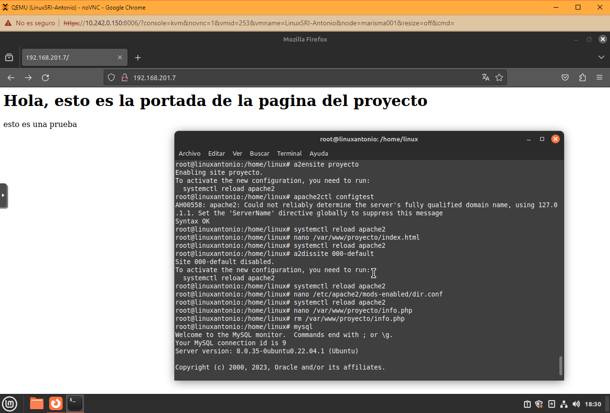

# Proyecto 1º Trimestre
## Pasos del proyecto

**Paso 1: Instalación de Apache**

Empezamos instalando el servicio Apache, en ejercicios anteriores ya se muestra como se instala, saltaremos todos estos pasos y subiré una captura con todo instalado:

**También tenemos que instalar una base de datos para previamente subir al wordpress**
Abre el terminal de MySQL escribiendo el siguiente comando:

Para establecer una contraseña para el usuario root utlizamos:

Utiliza el siguiente comando para crear una base de datos de WordPress:

Ahora, crearemos una cuenta de usuario MySQL para operar en la nueva base de datos de WordPress. Utilizaremos WordPressDB como nombre de la base de datos y UsuarioWordPress como nombre de usuario. Para crear un nuevo usuario y otorgar privilegios usa el siguiente comando:

**Paso 2: Activar dominios**

Para usar los dominios requeridos por la práctica, nos debemos ir al archivo hosts que se encuentra en la carpeta /etc, mediamente el comando nano /etc/hosts vamos a editar el documento para añadir los 2 dominios:

**Paso 3: Instalar Wordpress**

A continuación, para instalar wordpress, empezaremos por crear un archivo de wordpress.conf, con el comando **nano /etc/apache2/sites-available/wordpress.conf**

Escribiremos el siguiente texto:

Crearemos una carpeta con el comando **mkdir /var/www/wordpress**

Ahora, activa el mod_rewrite para utilizar la función de permalink o enlace permanente de WordPress:

Tendremos que reiniciar el servidor web Apache utilizando el siguiente comando:

El siguiente paso es cambiar la directiva ServerName en el archivo /etc/apache2/apache2.conf. Abre el archivo con este comando: 

Tendrás que configurar la directiva ServerName con la dirección IP o el nombre del servidor añadiendo la siguiente línea al archivo /etc/apache2/apache2.conf: 

**Ahora pasaremos a instalar wordpress**
Primero, instala el paquete wget en tu VPS:

A continuación, utiliza el comando wget seguido del enlace de descarga de WordPress:

Una vez que hayas descargado el archivo comprimido, instala la utilidad de descompresión utilizando estos comandos:

Ahora tendrás que mover el archivo al directorio correcto antes de descomprimirlo. Utiliza el comando:

A continuación, navega hasta el directorio y descomprime el archivo utilizando estos comandos:

Después, utiliza el siguiente comando para mover el directorio:

El último paso es eliminar index.html. Utiliza el siguiente comando:

Una vez hecho esto, reinicia Apache utilizando estos comandos:

Primero, selecciona un idioma para WordPress y haz clic en Continuar.

Aparecerá un mensaje de Bienvenida a WordPress:

Luego te llevará a la página principal de configuración:

Después, tendrás que introducir más información:

Una vez instalado, procederemos a poder editar nuestra pagina:

**Paso 4: Python bajo Apache**

Para habilitar mod_wsgi en Apache, basta con instalar el paquete libapache2-mod-wsgi-py3:
**sudo apt-get install libapache2-mod-wsgi-py3**

Crear la estructura de directorios para nuestra aplicación
**mkdir /home/linux/curso-python/trunk/python-web**

Dentro de este directorio, vamos a dividir su arquitectura en dos partes:

1- Destinada al almacenaje de nuestra aplicación Python pura (será un directorio privado, no servido).

2- Destinada a servir la aplicación (directorio público servido) en el cuál solo almacenaremos archivos estáticos.

**mkdir /home/yo/curso-python/trunk/python-web/mypythonapp**
**mkdir /home/yo/curso-python/trunk/python-web/public_html**

Dentro de nuestro directorio mypythonapp, almacenaremos entonces, todos los módulos y paquetes de nuestra aplicación Python, mientras que en public_html, estarán todos los archivos estáticos y será el único directorio al que se pueda acceder mediante el navegador Web.

Aprovecharemos este paso, para crear una carpeta, destinada a almacenar los logs de errores y accesos a nuestra Web App:

**mkdir /home/linux/curso-python/trunk/python-web/logs**

**Crear un controlador para la aplicación:**
Todas las peticiones realizadas por el usuario (es decir, las URI a las cuáles el usuario acceda por el navegador), serán manejadas por un único archivo, que estará almacenado en nuestro directorio mypythonapp.

**echo '# -*- coding: utf-8 -*-' > mypythonapp/controller.py**

Ahora, editaremos el archivo creado .py con la siguiente información:

