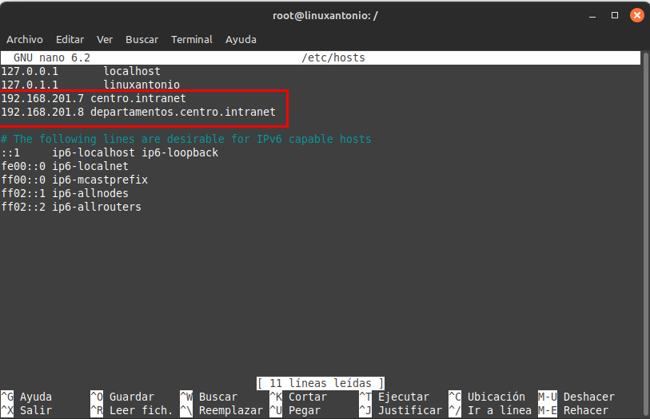

# Proyecto 1º Trimestre
## Pasos del proyecto

**Paso 1: Instalación de Apache**

Empezamos instalando el servicio Apache, en ejercicios anteriores ya se muestra como se instala, saltaremos todos estos pasos y subiré una captura con todo instalado:

**Paso 2: Activar dominios**

Para usar los dominios requeridos por la práctica, nos debemos ir al archivo hosts que se encuentra en la carpeta /etc, mediamente el comando nano /etc/hosts vamos a editar el documento para añadir los 2 dominios:

